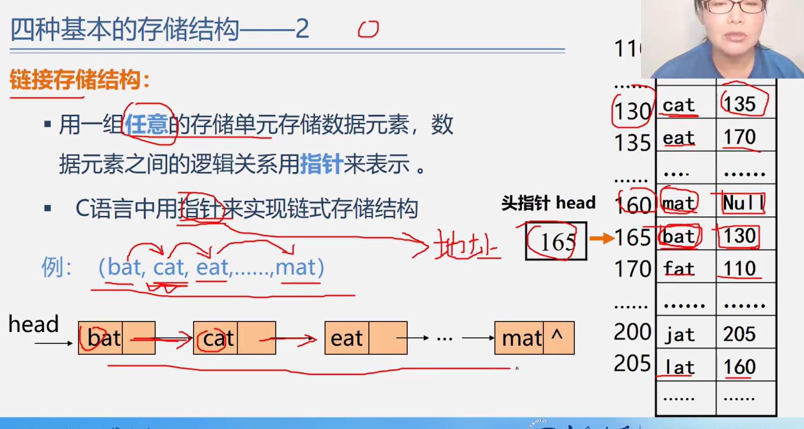
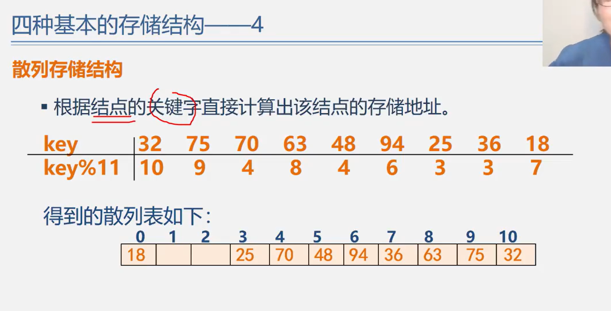
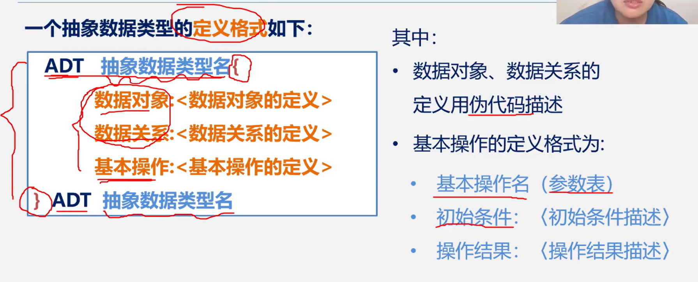
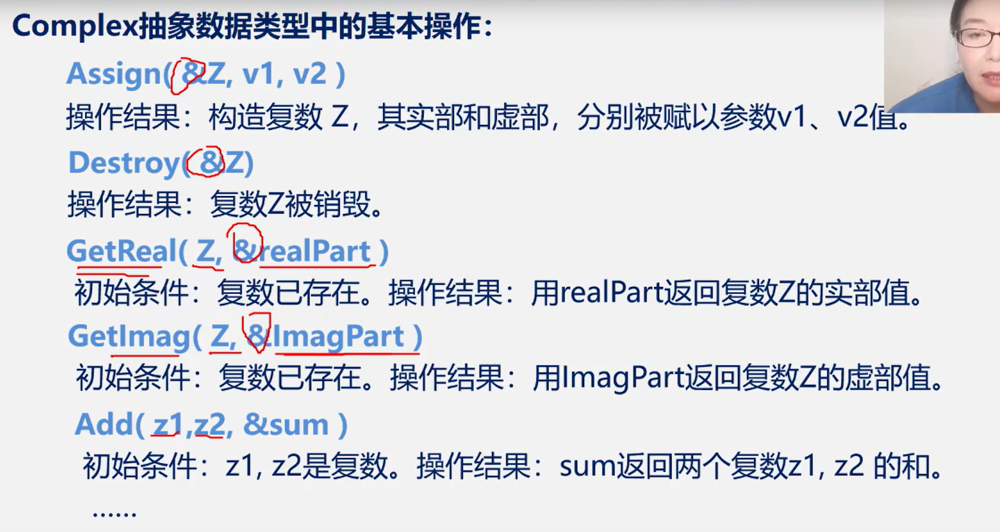
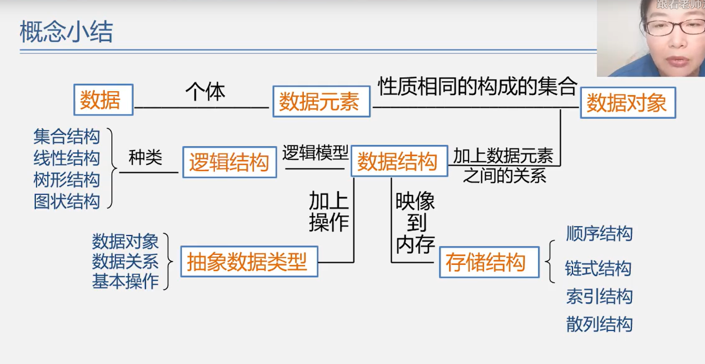
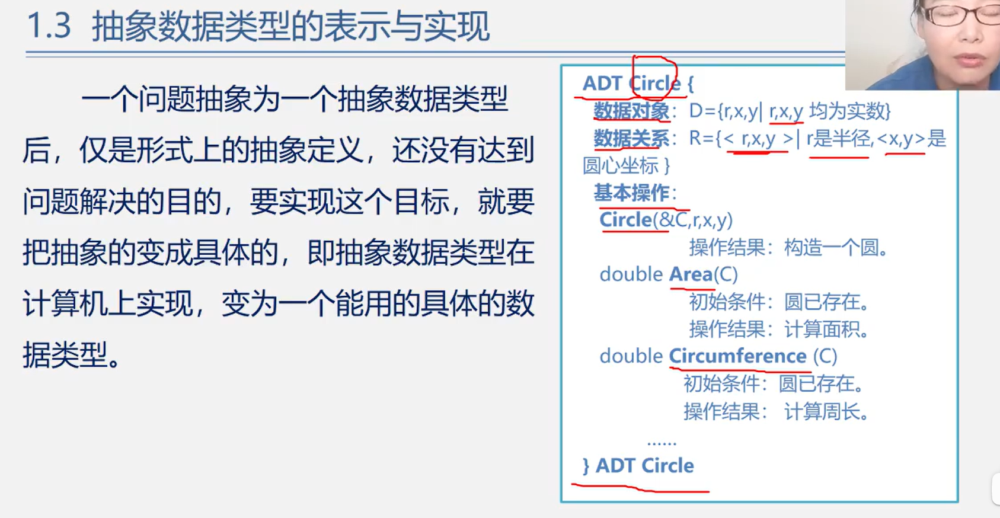
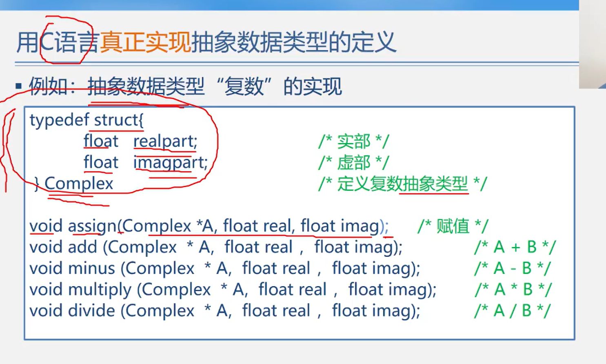
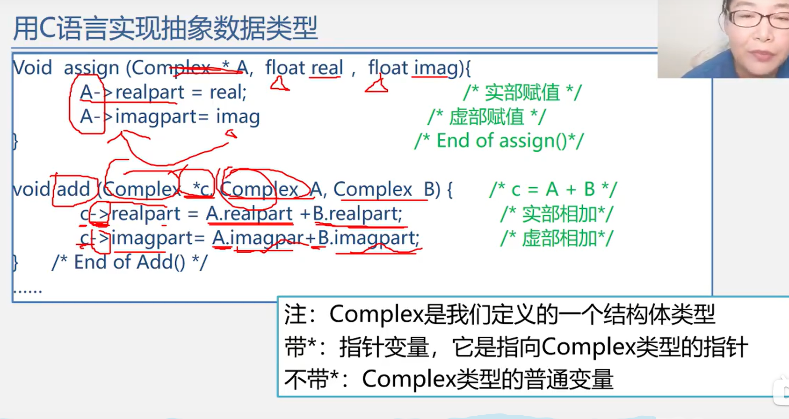
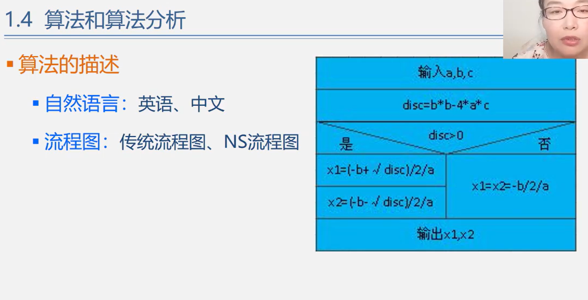
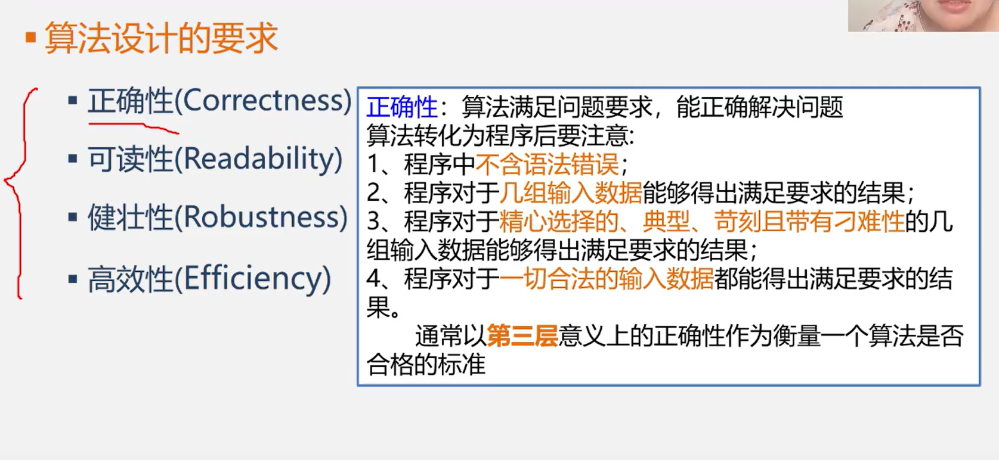

# 1、绪论

## 1.1、 数据结构的研究内容

> **首先，分析问题、提取操作对象；然后，找出操作对象之间的关系，用数学语言加以描述，建立相应数学方程；最后，求解数学方程：高斯消元法、有限元法、差分法......**
>
> ​																									     			——计算数学研究范畴

==<!--特点：数据元素间的关系简单，计算复杂-->==

- 学籍管理系统

随着计算机应用领域的扩展，计算机被越来越多地用于非数值计算

| 学号     | 姓名   | 性别 | 籍贯 | 专业     |
| -------- | ------ | ---- | ---- | -------- |
| 60214201 | 阳阳   | 男   | 广东 | 软件工程 |
| 60214202 | 雪琳   | 男   | 广东 | 软件工程 |
| 60214203 | 王诗萌 | 女   | 广东 | 软件工程 |
| 60214204 | 冯子涵 | 女   | 广东 | 软件工程 |

操作**对象**：每位学生的信息（学号、姓名、性别、籍贯、专业）

操作**算法**：查询、插入、修改、删除等

操作对象之间的**关系**：线性关系

**数据结构**：线性数据结构、线性表

类似的还有图书管理系统、人事管理系统、仓库管理系统、通讯录......

- 人机对弈问题

之所以能对弈：策略已经输入计算机，可以根据当前棋盘格局，来预测棋局发展的趋势，甚至最后结局

操作**对象**：各种棋局状态，即描述棋盘的格局信息

操作**算法**：走棋，即选择一种策略使棋局状态发生变化（有一个格局派生出另一个格局）

操作对象之间的**关系**：非线性关系、树

> 文件系统的系统结构图是典型的非线性关系结构——**树形结构**

- 地图导航——求最短路径（最快路径）

问题：找到图中两点之间的最短路径和最经济路径

操作**对象**：各地点及路的信息

计算机**算法**：设置信号灯，求出各个可同时通行的路的集合

对象之间的**关系**：非线性关系、网状结构

- 小结
  - 这些问题的共性是都无法用数学的公式或方程来描述，是一些“**非数值计算**”的程序设计问题
  - 描述非数值计算问题的数学模型不是数学方程，而是诸如**表、树**和**图**之类的具有**逻辑关系**的数据
  - **数据结构**是一份研究**非数值计算**的程序设计中计算机的**操作对象**一级它们之间**关系**和**操作**的学科

## 1.2、基本概念和术语

### 1.2.1、数据、数据元素、数据项和数据对象

- 数据（Data）
- 数据元素（Data Element）
- 数据项（Data Item）
- 数据对象（Data Object）

#### 1、数据（Data）

- 数据
  - 是能输入就计算机且能被计算机处理的各种符号的集合
    - 信息的载体
    - 是对客观事物符号化的表示
    - 能被计算机识别、存储和加工
  - 包括：
    - 数据型的数据：整数、实数等
    - 非数值型的数据：文字、图像、图形、声音等

#### 2、数据元素（Data Element）

- 数据元素
  - 是数据的基本单位，在计算机程序中通常作为一个整体进行考虑和处理
  - 也简称元素，或称为记录、结点或顶点
  - 一个数据元素可由若干个数据项组成（Data Item）

#### 3、数据项（Data Item）

- 数据项

  - 构成数据元素的不可分割的最小单位

  - 数据、数据元素、数据项三者之间的关系：

    ​	数据  > 数据元素  >  数据项

#### 4、数据对象（Data Object）

- 数据对象
  - 是性质相同的数据元素的集合，是数据的一个子集
  - 整数数据对象是集合N={0, +-1, +-2, ....}
  - 字母字符数据对象是集合C={'A', 'B', ..., 'Z'}
  - 学籍表也可看做一个数据对象

#### 5、数据元素与数据对象的关系

- 数据元素——组成数据的基本单位
  - 与数据的关系：是集合的个体
- 数据对象——性质相同的数据元素的集合
  - 与数据的关系是：集合的子集

### 1.2.2、数据结构

- 数据结构
  - 数据元素不是孤立存在的，他们之间存在着某种关系，数据元素相互之间的关系称为结构（Structure）
  - 实质相互之间存在一种或多种特定关系的数据元素集合
  - 是带结构的数据元素的集合

#### 数据结构的两个层次

- 逻辑结构
  - 描述数据元素之间的逻辑关系
  - 与数据的存储无关，独立于计算机
  - 是从具体问题抽象出来的数学模型
- 物理结构（存储结构）
  - 数据元素及其关系在计算机存储器中的结构（存储方式）
  - 是数据结构在计算机中的表示
- 逻辑结构与存储结构的关系：
  - 存储结构是逻辑关系的映象与元素本身的映象
  - 逻辑结构是数据结构的抽象，存储结构是数据结构的实现
  - 两者综合起来建立了数据元素之间的结构关系

#### 逻辑结构的种类

> 划分方法一

1. 线性结构 

   有且仅有一个开始和一个终端结点，并且所有结点都最多只有一个直接前驱和一个直接后继

   ​		例如：线性表、栈、队列、串

2. 非线性结构

   一个结点可能有多个直接前驱和直接后继

   ​		例如：树、图

> 划分方式二——四类基本逻辑结构

1. 集合结构：结构中的数据元素之间除了同属于一个集合的关系外，没任何其他关系
2. 线性结构：结构中的数据元素之间存在着一对一的线性关系
3. 树形结构：结构中的数据元素之间存在着一对多的层次关系
4. 图状结构或网状结构：结构中的数据元素之间存在着多对多的任意关系

> 存储结构的种类

四种基本的存储结构

- 顺序存储结构
- 链式存储结构
- 索引存储结构
- 散列存储结构

1. 顺序存储结构：

   - 用一组连续的存储单元一次存储数据元素，数据元素之间的逻辑关系由元素的存储位置来表示

   - C语言中用数组来实现顺序存储结构

     

2. 链式存储结构

   - 用一组任意的存储单元存储数据元素，数据元素之间的逻辑关系用指针来表示

   - C语言中用指针来实现链式存储结构

     

3. 索引存储结构

   - 在存储节点信息的同时，还建立附加的索引表

   - 索引表中的每一项称为一个索引项

   - 索引项的一般形式是：（关键字，地址）

   - 关键字是能唯一标识一个结点的那些数据项

   - 若每个结点在索引表中都有一个索引项，则该索引表称之为稠密索引（Dense Index）。若一组结点在索引表中只对应一个索引项，则该索引表称之为稀疏索引（Sparse Index）

     

4. 散列存储结构

   - 根据结点的关键字直接计算出该结点的存储地址

     

### 1.2.3、数据类型和抽象数据类型

- 在使用高级程序设计语言编写程序时，必须对程序中出现的每个变量、常量或表达式，明确说明他们所属的数据类型
  - 例如，C语言中：
    - 提供int，char，float，double等基本数据类型
    - 数组、结构、共用体、枚举等构造数据类型
    - 还有指针、空（void）类型
    - 用户也可用typedef自己定义数据类型
- 一些最基本数据结构可以用数据类型来实现，如数组、字符串等；
- 而另一些常用的数据结构，如栈、队列、树、图等，不能直接用数据类型来表述
- 高级语言中的数据类型明显地或隐含的规定了在程序执行期间变量和表达的所有可能的取值范围，以及在这些数值范围上所允许进行的操作
  - 例如，C语言中定义变量i为int类型，就表示i是[-min,max]范围的整数，在这个整数集上可以进行+、-、*、/、%等操作
- 数据类型的作用
  - 约束变量或常量的取值范围
  - 约束变量或常量的操作
- 数据类型（Data Type）
  - 定义：数据类型十一组性质相同的值的集合以及定义这个值的集合上的一组操作的总称。

数据类型=值的集合+值集合上的一组操作

- 抽象数据类型（Abstract Data Type，ADT）

  是指一个数学模型以及定义在此数学模型上的一组操作

  - 由用户定义，从问题抽象出数据模型（逻辑结构）
  - 还包括定义在数据模型上的一组抽象运算（相关操作）
  - 不考虑计算机内的具体存储结构与运算的具体实现算法

抽象数据类型的形式定义

​	抽象数据类型可用（D,S,P）三元组表示。

​	其中：D是数据对象；

​				S是D上的关系集；

​				P是对D的基本操作集

基本操作定义格式说明：

==参数表==：赋值参数 只为操作提供输入值

​				引用参数 以&打头，除可提供输入值外，还将返回操作结果

==初始条件==：描述操作执行之前数据结构和参数应满足的条件，若不满足，则操作失败，并返回相应出错信息。若初始条件为空，则省略之。

==操作结果==：说明操作正常完成之后，数据结构的变化状况和应返回的结果

## 1.3、抽象数据类型的表示与实现

​        一个问题抽象为一个抽象数据类型后，仅是形式上的抽象定义，还没有达到问题解决的目的，要实现这个目标，就要把抽象的变成具体的，即抽象数据类型在计算机上实现，变为一个能用的具体的数据类型。

#### 抽象数据类型的实现

#### 抽象数据类型如何实现

- 抽象数据类型可以通过固有的数据类型（如整型、实型、字符型等）来表示和实现
  - 即利用处理器中已存在的数据类型来说明新的结构，用已经实现的操作来组合新的操作

## 1.4、算法和算法分析

- 算法的定义

  - 对特定问题求解方法和步骤的一种描述，它是指令的有限序列。其中每个指令表示一个或多个操作。（简而言之，算法就是解决问题的方法和步骤）

- 算法的描述

  - 自然语言：英语、中文

    

  - 流程图：传统流程图、NS流程图

    

    

  - 伪代码：类语言：类C语言

  - 程序代码：C、Java

- 算法与程序

  - 算法是解决问题的一种方法或一个过程，考虑如何将输入转换成输出，一个问题可以有多种算法
  - 程序时用某种程序设计语言对算法的具体实现

- 算法特性：

  - 有穷性：一个算法必须总是在执行有穷步之后结束，且每一步都在有穷时间内完成
  - 确定性：算法中的每一个指令必须有确切的含义，没有二义性，在任何条件下，只有唯一的一条执行路径，即对于相同的输入只能得到相同的输出
  - 可行性：算法是可执行的，算法描述的操作可以通过已经实现的基本操作执行有限次来实现。
  - 输入：一个算法有零个或多个输入
  - 输出：一个算法有一个或多个输出

- 算法设计的要求

  - 正确性（Correctness）

    

  - 可读性（Readability）

    

  - 健壮性（Robustness）

    

  - 高效性（Efficiency）

    

- 算法分析

  - 一个好的算法首先要具备正确性，然后是健壮性，可读性，在几个方面都满足的情况下，主要考虑算法的效率，通过算法的效率高低来判断不同算法的优劣程度

  - 算法效率以下两个方面来考虑：

    1. 时间效率：指的是算法所耗费的时间
    2. 空间效率：指的是算法执行过程中所耗费的存储空间

    - 时间效率和空间效率有时候是矛盾的

- 

